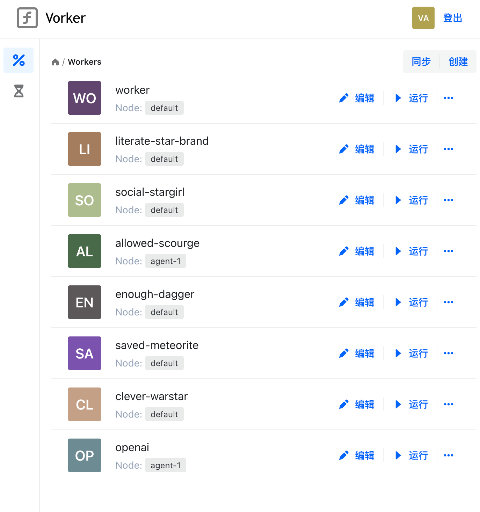
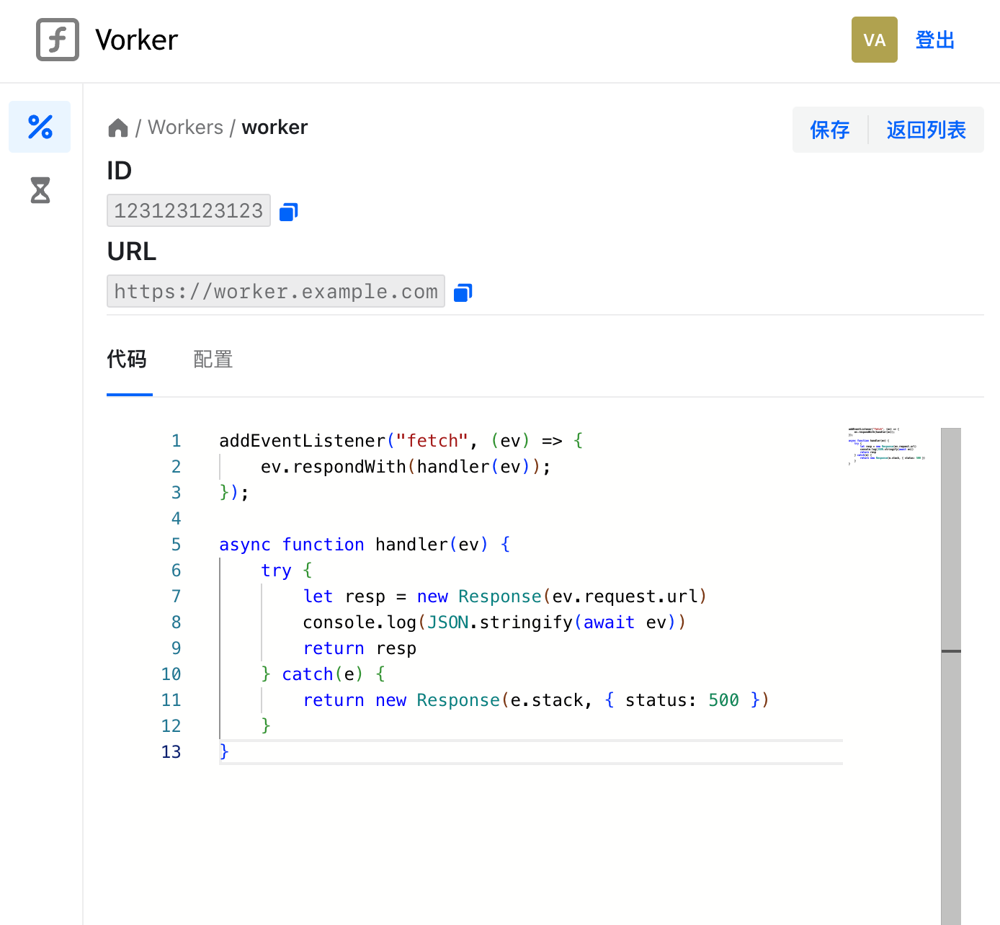
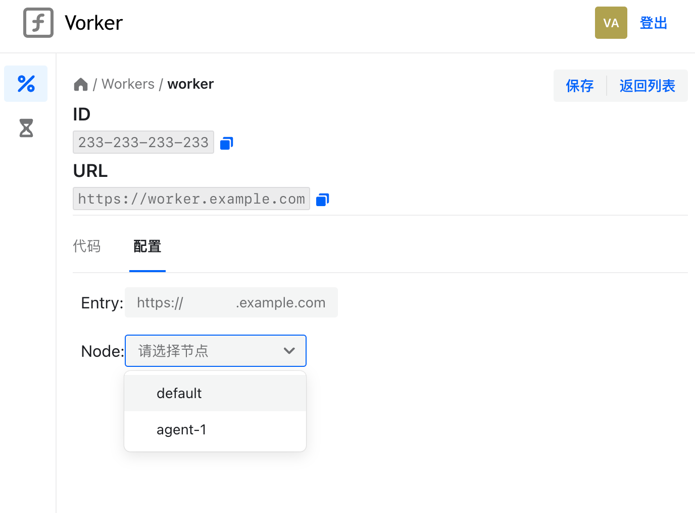
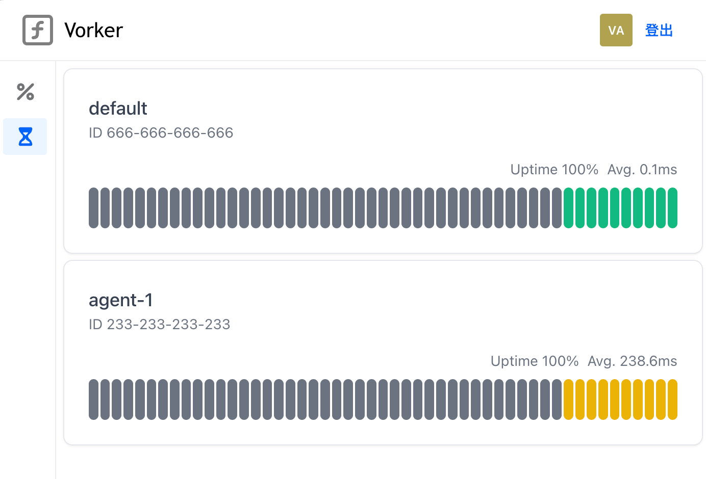

> **⚠️ Notice**
> 
> The ongoing development of this project has moved to [frp-panel](https://github.com/VaalaCat/frp-panel).  
> All future features and updates will be iterated there!  
> 
> frp-panel includes and enhances all the functionality of vorker. Feel free to explore, contribute, and enjoy the improvements!

# Vorker

Vorker is a simple and powerful self host cloudflare worker alternative which built with cloudflare's [workerd](https://github.com/cloudflare/workerd).

Fearues and Issues are welcome!


## Sponsors

本项目 CDN 加速及安全防护由 Tencent EdgeOne 赞助：EdgeOne 提供长期有效的免费套餐，包含不限量的流量和请求，覆盖中国大陆节点，且无任何超额收费，感兴趣的朋友可以点击下面的链接领取

[亚洲最佳CDN、边缘和安全解决方案 - Tencent EdgeOne](https://edgeone.ai/zh?from=github)


## Features

- [x] User authentication
- [x] API control
- [x] Multi worker routing
- [x] Woker CRUD Management
- [x] Web UI & Online Editor
- [x] Multi Node
- [x] HA support
- [x] Cloudflare Durable Objects (experimental)
- [ ] Log
- [ ] Metrics
- [ ] Worker version control
- [ ] Worker Debugging
- [ ] Support KV storage

## Usage

### Docker

1. Run by docker command or download the docker-compose.yml from repo and execute `docker-compose up -d`.

all envs defined in [env.go](./conf/env.go), you can take a look at it for more details.

```bash
docker run -dit --name=vorker \
	-e WORKER_URL_SUFFIX=.example.com \
	-e COOKIE_DOMAIN=example.com \
	-e ENABLE_REGISTER=false \
	-e JWT_SECRET=xxxxxxx \
	-e AGENT_SECRET=xxxxxxx \
	-p 8080:8080 \
	-p 8888:8888 \
	-p 18080:18080 \
	-v /tmp/workerd:/workerd \
	vaalacat/vorker:latest

# this is a example, you can change the env to fit your need
# for this example, you can visit http://localhost:8888/admin to access the web ui
# and the worker URL will be: SCHEME://WORKER_NAME.example.com
```

2. test your workerd, if your vorker is running on localhost, you can use curl to test it.

visit `http://localhost:8888/admin` to control your worker.

```bash
curl localhost:8080 -H "Host: workername" # replace workername with your worker name
```

4. enjoy your untimate self hosted worker!

## Examples

### Request Proxy Service

This is an example of request proxy service.

You can use it like this:

```
curl https://worker.example.com/https://google.com
```

- Code

```js
addEventListener("fetch", (event) => {
	event.respondWith(handler(event));
});

async function handler(event) {
	try {
		const url = new URL((event.request.url).replace('http','https'));
		const param = url.pathname.substring(1)
		if (param.length==0) {
			return new Response("{\"error\": \"proxy addr nil\"}")
		}
		const newHost = new URL(param);
		
		url.host = newHost.hostname;
		return fetch(new Request(newHost, event.request))
	} catch(e) {
		return new Response(e.stack, { status: 500 })
	}
}
```

### Cloudflare Durable Objects

> Note: Currently, vorker can use workerd durable objects config, but worked is not ready yet for on disk object, so this is not really durable, when a worker is restarted or migrated, the durable objects will be lost.

- Template

```capnp
using Workerd = import "/workerd/workerd.capnp";

const config :Workerd.Config = (
  services = [
    (name = "{{.UID}}", worker = .v{{.UID}}Worker),
  ],

  sockets = [
    (
      name = "{{.UID}}",
      address = "{{.HostName}}:{{.Port}}",
      http=(),
      service="{{.UID}}"
    ),
  ]
);

const v{{.UID}}Worker :Workerd.Worker = (
  modules = [
    (name = "{{.Entry}}", esModule = embed "src/{{.Entry}}"),
  ],
  compatibilityDate = "2023-04-03",
  durableObjectNamespaces = [
    (className = "counter", uniqueKey = "xxxxxxx", preventEviction = true),
  ],
  durableObjectStorage = (inMemory = void),
  bindings = [
    (name = "tests", durableObjectNamespace = "counter"),
  ],
);
```

- Code

```js
export default {
  async fetch(request, env) {
    let ip = request.headers.get("x-forwarded-for") || request.headers.get("x-real-ip") || request.ip
    let id = env.tests.idFromName(ip);

    let test = env.tests.get(id);
    return test.fetch(request)
  }
}

export class counter {
  constructor(controller, env) {
    this.cnt = 0;
  }

  async fetch(request) {
    this.cnt = this.cnt + 1
    return new Response(this.cnt);
  }
}
```

### Use Cloudflare `wrangler` to build

Run those command in your wrangler project:

```bash
wrangler deploy --dry-run --outdir dist
```

and copy the `dist/index.js` file content to vorker's editor

modify the template to:

```capnp
using Workerd = import "/workerd/workerd.capnp";

const config :Workerd.Config = (
  services = [
    (name = "{{.UID}}", worker = .v{{.UID}}Worker),
  ],

  sockets = [
    (
      name = "{{.UID}}",
      address = "{{.HostName}}:{{.Port}}",
      http=(),
      service="{{.UID}}"
    ),
  ]
);

const v{{.UID}}Worker :Workerd.Worker = (
  modules = [
    (name = "{{.Entry}}", esModule = embed "src/{{.Entry}}"),
  ],
  compatibilityDate = "2023-04-03",
);
```

and click Save, all is done.


## Screenshots

- Admin Page



- Worker Editor



- Worker Config



- Agent Status



- Worker Execution


